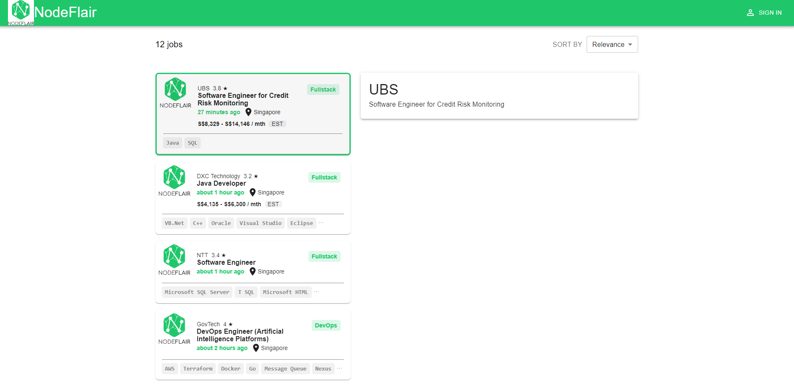

# NodeFlair Jobs Listings Clone

This project is a partial replica of the well-known tech job platform, NodeFlair, focusing on their job listings column.

## Demo

Visit the live version of the app: [NodeFlair Jobs Listings Clone Demo](https://nodeflair-frontend-vert.vercel.app/)

## Features

- Display of tech job listings with relevant information such as company name, job position, location, posted date, salary, and skills required.
- A visual indication of the currently selected job.
- Responsive design that adjusts to different screen sizes.

## Technologies Used

- React.js
- Material-UI for components and styling.
- Other utilities like React icons.

## Acknowledgments

- [NodeFlair](https://www.nodeflair.com/) for the inspiration and design reference.
- [Material-UI](https://mui.com/) for the comprehensive components and design system.

---
